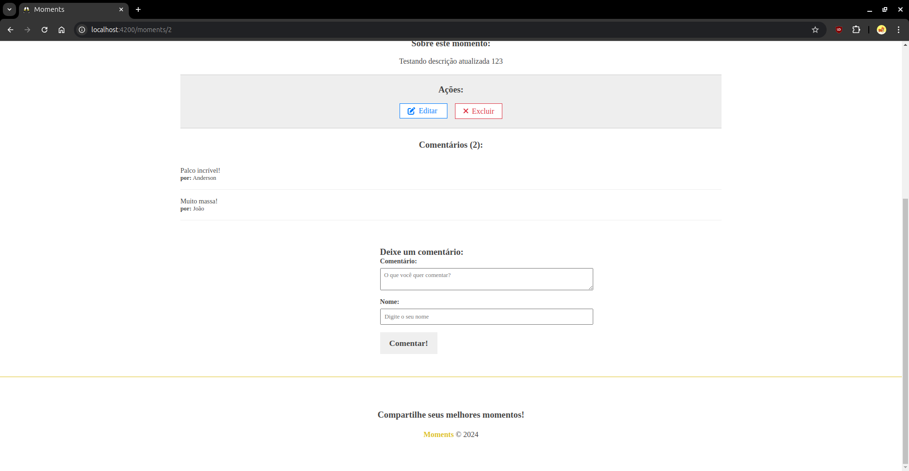

# Moments

Moments é um projeto front-end desenvolvido, principalmente, com Angular 18. A API que este projeto consome está [aqui](https://github.com/Anso-M/moments-adonis-api).

## Tecnologias Usadas

- **Angular** (versão 18.2.0)
- **RxJS** (~7.8.0)
- **TypeScript** (~5.5.2)
- **Font Awesome** para ícones

## Instalação

### 1. Clonar o Repositório

Para começar, clone o repositório do projeto:

```bash
git clone https://github.com/Anso-M/moments.git
cd moments
```

### 2. Instalar Dependências

Execute o comando a seguir para instalar as dependências do projeto:

```bash
npm install
```

Após instalar as dependências, para rodar o projeto localmente, você pode usar o seguinte comando:

   ```bash
   ng serve
   ```

Isso abrirá o aplicativo no navegador, geralmente em `http://localhost:4200`.

## Funções do Projeto

O projeto **Moments** oferece as seguintes funcionalidades para o gerenciamento e interação com os momentos:

### 1. **Visualizar Momentos**
   - O usuário pode visualizar uma lista de momentos registrados, que são exibidos de maneira clara e organizada na interface.
   - Cada momento contém informações como título, data, descrição, e imagem associada.


### 2. **Criar Novo Momento (Compartilhar)**
   - O usuário pode criar novos momentos, preenchendo informações como título, descrição e imagem (opcional).
   - O momento criado será automaticamente adicionado à lista de momentos, com a possibilidade de visualização imediata.


### 3. **Editar Momento**
   - O usuário pode editar momentos existentes para atualizar informações como o título, descrição e/ou imagem.


### 4. **Excluir Momento**
   - O usuário tem a opção de excluir momentos que não deseja mais visualizar ou manter.


### 5. **Buscar Momento**
   - O usuário pode buscar momentos específicos usando caracteres contidos nos títulos dos momentos, facilitando a navegação na lista.

### 6. **Adicionar comentário ao momento**
   - O usuário pode adicionar comentários à cada um dos momentos individualmente.
   - Após abrir a página de um momento específico, basta preencher o campo do comentário e o nome do autor e clicar em comentar.


